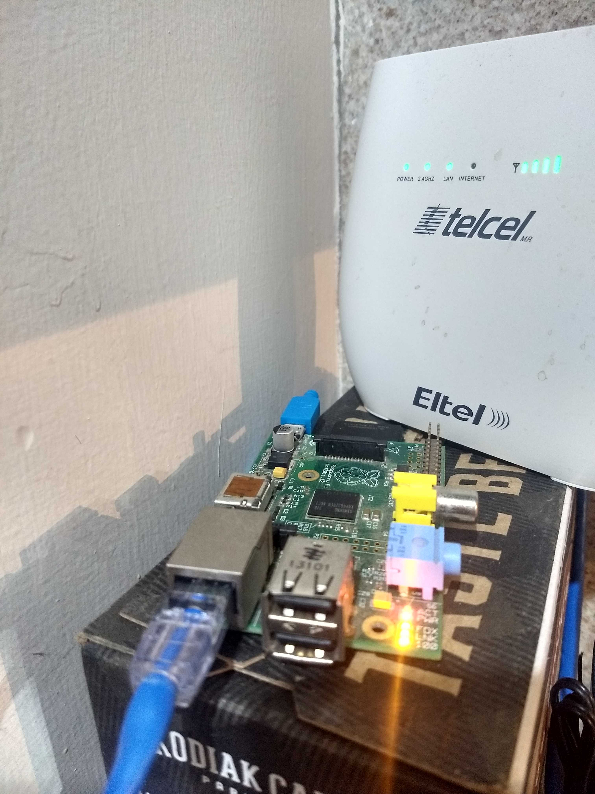

One of our projects ([cazadescuentos.net](https://cazadescuentos.net)) uses web-scraping to scan several online stores to find discounts. Lately, we started supporting some stores that seem to block requests coming from common cloud proivdes (like AWS, DigitalOcean, etc), if you are curious, the websites are [BestBuy](https://www.bestbuy.com) and [Costco Mexico](https://www.costco.com.mx).

A popular workaround to mitigate this problem is to pay for a proxy service to scrape these websites, sadly, we weren't able to find a reliable provider that was within our small budget.

Hence, we ended up building our own residential proxy, right now being powered by an old Raspberry Pi model B, it's worth adding that it wasn't as simple as we expected, specially keeping the SSH tunnel available (more on this below).



## Try it
If you like to jump directly to the code or to play with it, we have open sourced the [simple-http-proxy](https://github.com/wiringbits/simple-http-proxy).

For the time being, I feel brave enough to even let you try the proxy without running it, hoping I won't get a DoS, I'll very likely remove the access once someone abuses my old Pi.

This command tells my Pi to query `https://wiringbits.net` by sending the custom `DNT: 1` header:

```shell
curl -X POST \
  -H "Content-Type: application/json" \
  -d '{"url": "https://wiringbits.net", "headers": { "DNT": "1" }}' \
  "https://cazadescuentos.net/proxy"
```


## How it works
The approach is actually very simple:
- The Raspberry Pi runs a simple HTTP proxy.
- The Pi is connected to the internet on a router exclusive for it.
- As the Pi isn't easily accessible from the internet, it opens a SSH tunnel to the server that will connect to the proxy served by the pi.
- Our scraper invokes the proxy as if it was running on localhost.


## About security
Security considerations:
- Don't expose the proxy to the world or attackers will be able to interact with your home devices.
- Ideally, expose the proxy on an isolated network, different to the one where you connect your home devices.


## Pitfalls
I ended up investing more time than expected tweaking the necessary stuff to keep the proxy working reliable, the biggest problem was related the SSH tunnel.

If you see the actual [project](https://github.com/wiringbits/simple-http-proxy), it includes a systemd service to keep the tunnel opened with the necessary tweaks.

The tunnel command being:
- `/usr/bin/ssh -nNT -R 9999:localhost:9000 -o ConnectTimeout=10 -o ExitOnForwardFailure=yes -o ServerAliveInterval=180 ubuntu@cazadescuentos.net`

What matter the most:
- `ExitOnForwardFailure=yes` forces ssh to exit when there is a failure in the connection instead of silently staying running while the tunnel doesn't work.
- `ServerAliveInterval=180` keeps sending a ping to the server to avoid the server closing the connection due to inactivity.


## Future
It is very likely that if the proxy traffic increases considerably, it will get banned by some websites.

A more scalable approach could be to distribute these proxy devices into different locations, which prevents the SSH tunnel trick from being reasonable.

A possible approach is to use a queue service like AWS SQS/Kafka/etc to push the requests for scraping a website while the proxy devices could be fighting to consume the next request, if one doesn't complete the job, another one can try.

If you think about it, you don't need a Raspberry Pi, you can even build a very simple Android app serving the same purpose.

In any case, this is how the proxy has been running for a couple of months, and I hope it stays like this for a while.

This article has been translated to [Russian](https://softdroid.net/raspberry-pi-kak-dostoynyy-zhiloy-proksi).
