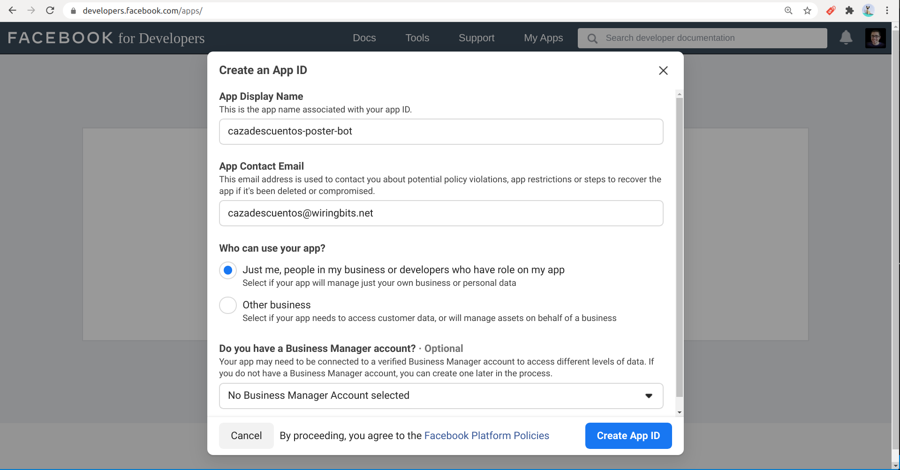
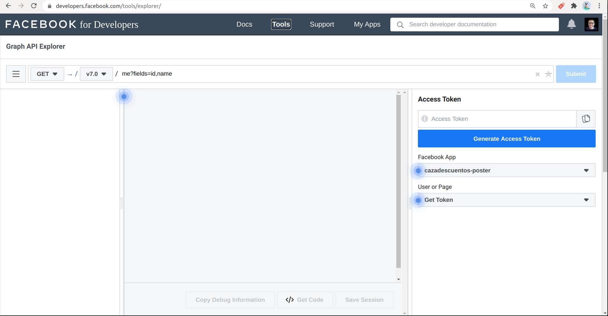
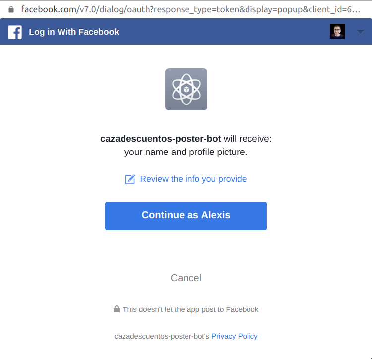
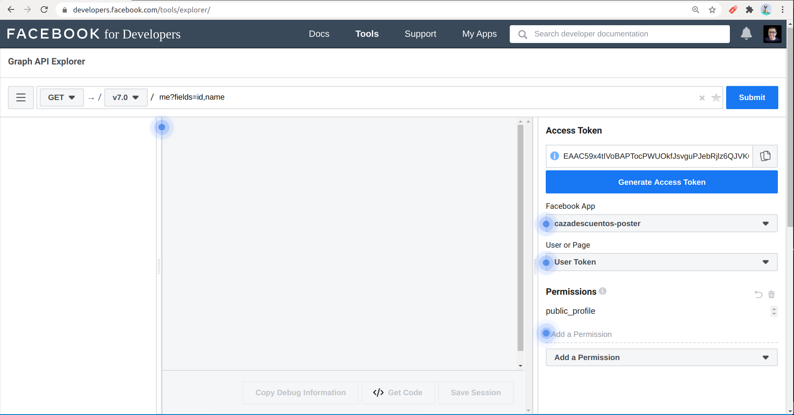
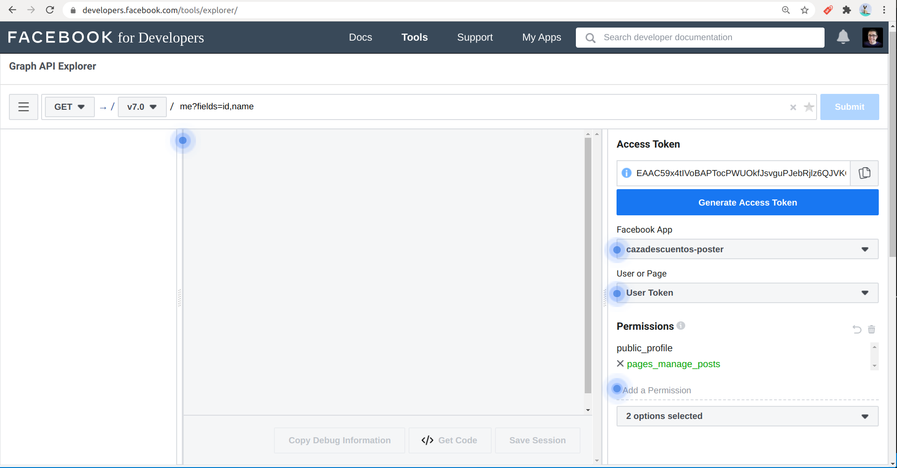
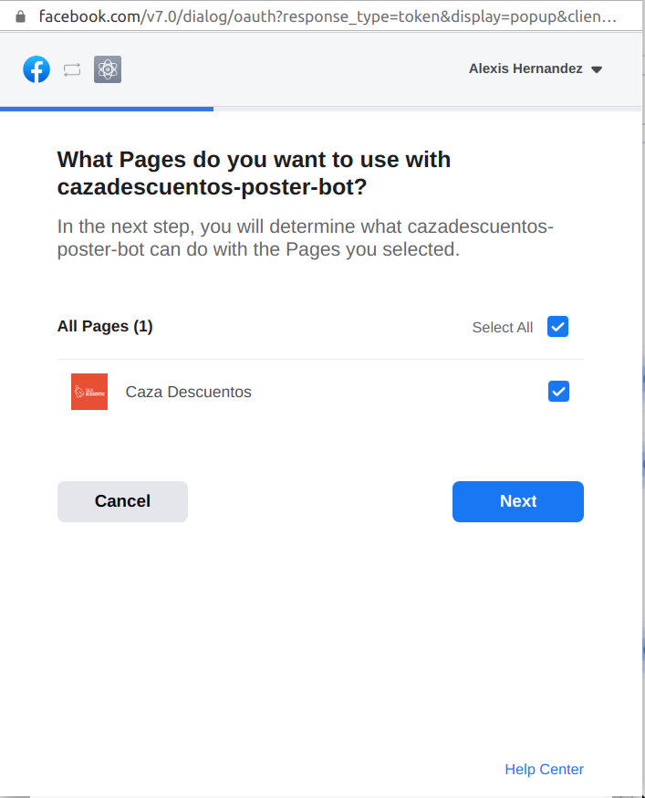
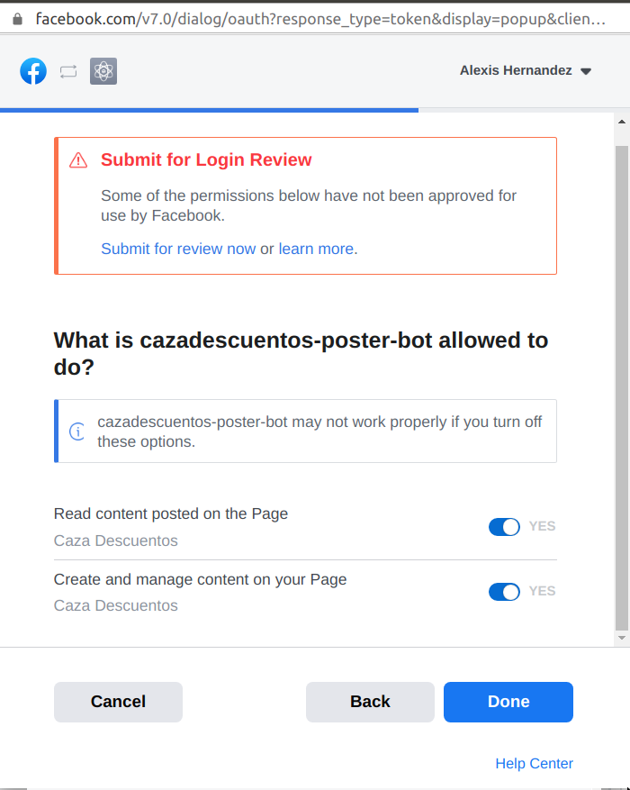
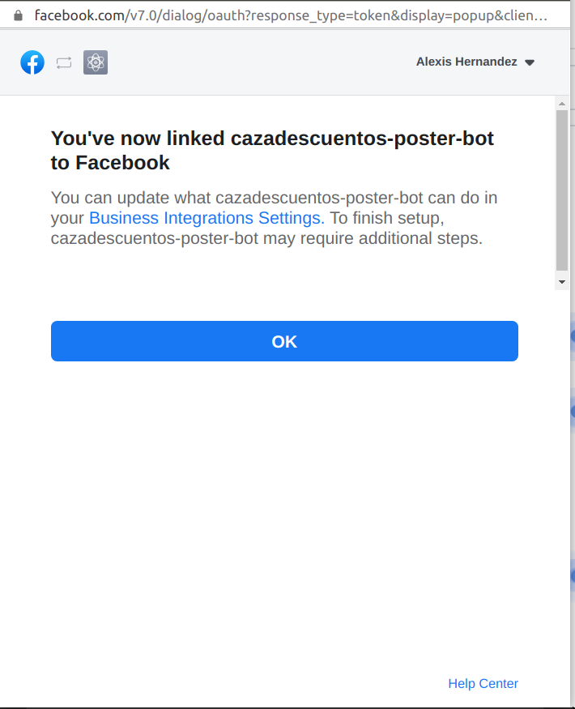
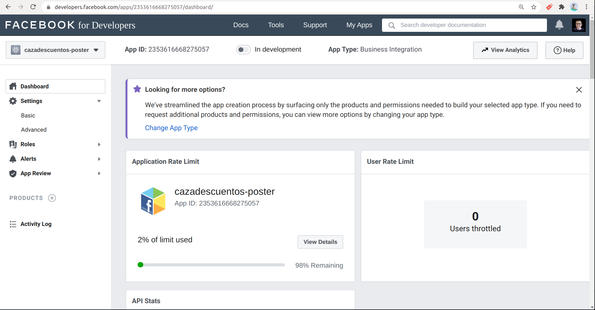
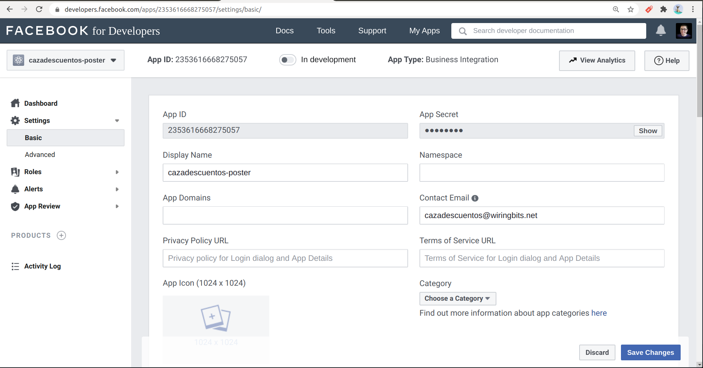

The reason to write this post, it's because I found tricky to use the Facebook API to publish on my own pages.

Be aware that I have no previous experience on the Facebook API, and I got confused on how to get the required details to actually play with the API, this post should serve as a note for myself, and hopefully, it will help others struggling with this.

## Background
One of our projects ([cazadescuentos.net](https://cazadescuentos.net)) has a Facebook [fan page](https://www.facebook.com/cazadescuentos.net), we started publishing the interesting discounts found by our app, but it's a tedious, and time consuming task. I got the idea to build a bot to keep the fan page updated automatically.

By now, you should see the automated posts our bot has created, I won't cover how to do that, as it's a simple API call once you get the right access token.


## Constraints
The official [docs](https://developers.facebook.com/docs/app-review) aren't clear if posting to your own page requires app review, and given my tests, you need the review.

Unfortunately, such reviews are paused for individuals indefinitely, but you can still apply if you are behind a business.


## The instructions
Now the actual step by step to get it working.

The first task to do, is to update your account to be a developer account, which can be done in [developers.facebook.com](https://developers.facebook.com/).


### Create an app
You can't get a token unless you create an app, which is done on [developers.facebook.com/apps](https://developers.facebook.com/apps/), in this case the `Manage Business Integrations` option is enough, then, these options are ok:
- Who can use this app? `Just me`.
- Do you have a business managed account? `No` (in my case, I'm able to choose my page, but I had issues when choosing it).



Now just click on `Create App Id`, which requires you to solve a Captcha, after that, you should get your `App id` (take a note of it for later).

The summary after this is:
- Use the app to get a short-lived user access token.
- Increase the scope for this token, so that it can be used to post on your page.
- Use the previous token, to get a long-lived user access token.
- Take the previous long-lived user access token, to get an actual page access token that doesn't expire.


### Get a short-lived user token
While you might try to get the page token directly, it won't work, Facebook will start complaining about your app not been verified, etc. if, you know, or you find a simpler way to do so, I'd thank you for such information.

Go to [Tools -> Graph API Explorer](https://developers.facebook.com/tools/explorer/)

On the right, choose these options, and then, click on the `Generate Access Token` button:
- Facebook App: `[Your app]`.
- User or Page: `Get Token`.


<br/><br/>


A popup should open, asking you for permission to login, which you should approve:

<br/><br/>

The `Access Token` field now displays a long token, and, the `Permissions` lists includes `public_profile` only.

<br/><br/>


### Add permissions to your short-lived user access token
Assuming you are on the previous screen, click on the `Add a Permission` option, select `Events Groups Pages`, and then, choose `pages_manage_posts`, click on `Generate Access Token` again (note, that's the only permission I need to post on my page, if you plan to do something else, make sure to review which permissions you need to do that).


<br/><br/>

You will be required to authorize the login again, but now, you are asked about which pages you will authorize to be managed by this token, choose your own, and click on `Next`.


<br/><br/>

This time, you get a warning about Facebook not approving the permissions, the text being:

```text
Submit for Login Review
Some of the permissions below have not been approved for use by Facebook.
Submit for review now or learn more.
```

Just ignore the warning, make sure the permission for creating content on the page is enabled, and, click on `Done`.


<br/><br/>


Now you get a confirmation that your app got linked to your page, there is a hyperlink where you could go to remove such integration if you ever need to, click on the `Ok` button to close the popup.


<br/><br/>


Now you have a short-lived user access token allowing you to post on your page.


### Get the long-lived user access token
Once you have the long-lived user access token (expires in 1 hour) allowed to post on your page, you can get a long-lived user access token.

Let's replace the following placeholders and invoke this API:
- `[app-id]` is the app id you got after creating your app.
- `[long-lived-user-access-token]` is the token you got in the previous step.
- `[client-secret]` is the value you need to find.

To get the client secret, go to your app dashboard, which you can choose on the [My Apps](https://developers.facebook.com/apps/) menu, then, choose `Settings -> Basic` on the left menu:


<br/><br/>

Then, click on the `Show` button that's next to the `App Secret` field 
(you will likely need to enter your Facebook password to authenticate), that's your `[client-secret]`, use it on the next API call (I believe this is only available once you generated your first token, otherwise, the `App Secret` isn't available).


<br/><br/>

Now, the actual call:

```shell
curl -i -X GET "https://graph.facebook.com/oauth/access_token?grant_type=fb_exchange_token&client_id=[app-id]&client_secret=[client-secret]&fb_exchange_token=[short-lived-user-access-token]"
```

The API call returns something like:

```json
{"access_token":"a_long_token","token_type":"bearer","expires_in":5183999}
```


### Get the actual page access token
We are almost done, now you just need to invoke another API, be sure to replace the `[page-id]` with your fan page id, and the `[long-lived-access-token]` with the one you got in the previous step.

How to get the page id is out of the scope on this post, I my case, I just visited my fan page, clicked on `View as a regular user`, and copied the id from the url on the browser navigation bar.

```shell
curl -i -X GET "https://graph.facebook.com/[page-id]/accounts?fields=name,access_token&access_token=[long-lived-access-token]"
```

Which returns something like:

```json
{"access_token":"a_long_token","id":"219581950295819"}
```

That's your long-lived page access token! It's a token that never expires.


### Try it
Now, let's create a post by invoking the Facebook API, replace the place holders making sure to provide the new token, and enjoy:

```shell
curl -i -X POST "https://graph.facebook.com/[page-id]/feed?message=Hello&access_token=[page-access-token]"
```


You should expect a response like:

```json
{"id":"105001477592284_283557336403363"}
```


### Troubleshooting
Facebook has a very useful tool for debugging access token, find it on the [Tools -> Access Token Debugger](https://developers.facebook.com/docs/pages/access-tokens) menu, there you can input the generated tokens to make sure what's their scope, lifetime, permissions, etc.

The page token we got should says:
- `Expires`: `Never`.


### More

It's worth that you check the official [docs](https://developers.facebook.com/docs/pages/overview) for the pages API.

Also, note that no one besides you will be able to see what you post until you switch to the live mode, by default your app is on development mode, see the official [docs](https://developers.facebook.com/docs/apps/#development-mode) for more details, once you switch to live mode, the token won't work unless your app has been verified.
