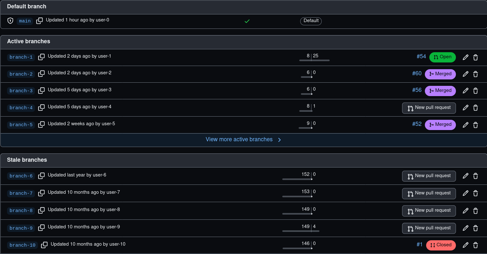

While working with multiple customers, we commonly suggest potential improvements to their Github repository setup, there is a chance others can benefit from this which is why I'm sharing the settings we follow while create new repositories.

Have you ever seen a situation like this? Many stale branches because developers forgot to delete those, this is a very common problem, I have even seen repositories with 1000+ stale branches which makes it hard to navigate through them, the below settings mention a way to prevent this as well as other useful details.

It would be nice if we could store these settings so that they get applied to new repositories by default, unfortunately, Github does not seem to support this.

## Summary

We'll tweak the repository `General` and `Branches` settings so that:

1. Enable `Automatically delete head branches`.
2. Enable `Always suggest updating pull request branches`.
3. Disable `Allow merge commits` (read below before arguing).
4. Update `Allow squash and merging` -> `Default commit message`.

Then, create a branch protection rule for important branches:

1. Enable `Require a pull request before merging` -> `Require approvals`.
2. Enable `Require status checks to pass before merging` -> `Require branches to be up to date before merging`
3. Enable `Require linear history`.

The reasons behind these settings are explained below.

## General settings

Access these items through the `Settings` button that's on each repository:

## 1. Automatically delete head branches

This is likely the item that most projects can apply, I don't know why Github does not set this by default.

Remember the stale branches issue that's mentioned in the intro? This is how you can prevent it, as soon as a Pull Request gets merged, the branch will be deleted automatically by Github.
