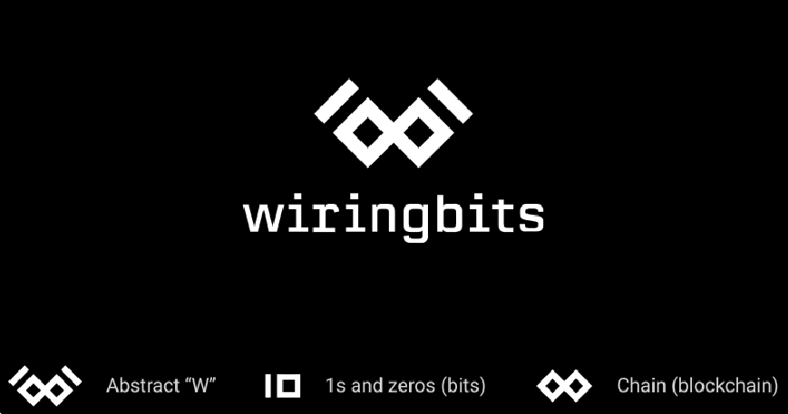

While wiringbits has been around unoficcially for years, it has been formally there since Jan/2019.

It's incredible how a team that works building different websites needs more than a year to build its own, I admit that I haven't considered it important because have been full of work since the beggining. I aslo kept delaying this because I wanted to get a logo.

In any case, now I prefer to complete the task than waiting for perfection, not having a name didn't prevented me from starting a team, then, a missing logo won't prevent me from creating a website.

One of the goals for this website is to try writing a post per month.

## Jan/2022 Update

3 years passed, 2021 was a year full of changes for us:

- Our team has grown considerably.
- We aren't a 100% Scala shop anymore, we started working in more diverse projects (Java/Kotlin/React/TypeScript/etc).
- We finally got a wonderful logo.

## Jun/2022 Update

In order to simplify the payment processes for our customers, we ended up incorporating a company in the United States.

### Logo

Getting a logo wasn't easy, I have tried to draft it many times, same way as my wife, and, others who I have asked to prepare it.

By 2021, one of our customers proposed us a logo, I couldn't believe how he did such a wonderful job, the logo couldn't be better, he did all of this without asking me a single question which I wasn't expecting, anyway, here it is:

Thanks a lot Michael Bruny-Groth, I hope that once we release your project, you get as happy as we are with the logo you created.
