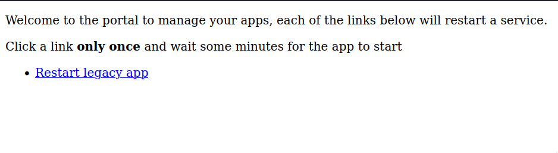

We got to work with a customer that has a legacy application that needs to get restarted frequently in order to get it working again, such a process is annoying for our customer because I'm the only one with production access but I'm not always available when a restart is required. Hence, I built a super simple app that allows my customer to restart the application.

It is worth highlighting that such an app can be created and launched in less than 1 hour.

## Context

This particular project has been running for many years, it has many customers using it the whole day, it works smoothly most of the times, still, there are some triggers that cause it to get into an unusable state, which has been solved by restarting the application.

The situation gets unfortunate when the legacy app gets unusable without me being available to restart it (more common than what I'd hope). It does not help that my customer is on the opposite side of the world, working with this app while I'm commonly outside of my office hours (or sleeping).

In an ideal world, we would dig into the problem and fix it, still, we can't actually modify any code on such a legacy system.

Right now, our effort is being invested into migrating the legacy app customers out of it, which makes it hard to justify putting enough time to create a decent application just to restart the legacy services, hence, I came up with a super simple app with the goal to create/launch it in around 1 hour.

Honestly, it took a bit more because I put extra time to figure details I wasn't expecting, still, I'm confident that the next time I do this, 30m should be good enough to do everything, hopefully you can do the same by taking this post as a guide.

## Summary

I got an idea about using nginx to serve a static html page + some handlers to execute shell scripts.

Assuming that this works, we could have some 1-line scripts to trigger actions on remote servers, for example `ssh legacy-app "service app restart"`

Googling for a few minutes confirmed that this seems a viable solution by using [lua-nginx-module](https://github.com/openresty/lua-nginx-module), such a module allow us to embed Lua scripts into nginx (which can execute shell scripts).

The ideal timing would be like:

- 30 minutes to launch a server to host the new app + granting ssh access so that it can perform operations on the legacy servers.
- 30 minutes to experiment with the setup, create the app/scripts, and, protect the app with a password.

Let's assume that you already have a clean server in the cloud which will be used to do this, the cheapest server from your cloud must be enough.

In short, we'll follow these steps:

1. Set up a non-privileged user in the new server, which will be used to execute the necessary commands, we'll need to generate an ssh-key that needs to be authorized at the servers holding the applications that need frequent restarts.
2. Prepare the necessary scripts that handle the restarts (or any other maintenance task).
3. Create a simple html page with links to trigger the script execution.
4. Install and configure [OpenResty](https://openresty.org) which has an nginx version including [lua-nginx-module](https://github.com/openresty/lua-nginx-module) (default nginx version does not have this), set up nginx to serve the simple html page, then, protect it with a password (http basic authentication).
5. Make sure that everything works the way you expect.

## Details

Let's start by getting a server in your preferred cloud, the cheapest one available should work fine.

In this case, I used ubuntu 20.04, most of the commands listed should work in other Linux servers.

### Initial setup

- First thing to do is to create a non-privileged user (called `dummy` in this case) which will ssh into the server that runs the app requiring restarts: `sudo useradd dummy --create-home`
- Let's become `dummy`: `sudo su - dummy`
- Generate an ssh key: `ssh-keygen`
- Copy the public part from the generated ssh key, content found at `cat ~/.ssh/id_rsa.pub`
- In another terminal, ssh into any server where `dummy` needs access, append the copied public key to `~/.ssh/authorized_keys`
- Confirm that `dummy` can access perform the restart task on those servers, for example: `ssh my-server "sudo service nginx restart"`

### Prepare scripts

By following previous steps, we have a terminal where we are logged in as user `dummy`, let's create a simple script that restarts the legacy app, in my case, I'd name it `restart-app.sh`:

```shell
#!/usr/bin/env bash
ssh legacy-server "sudo service nginx restart"
```

Be sure to replace `legacy-server` with your desired server and `sudo service nginx restart` with the command to restart your app.

Repeat this step with any other script you need to expose.

### Create the html page

This is a real-simple html that includes a link for each script from previous step (adapt it accordingly):

```html
<!doctype html>
<html lang="es">

<head>
  <meta http-equiv="X-UA-Compatible" content="IE=edge">
  <meta charset="utf-8">
  <meta name="viewport" content="width=device-width, initial-scale=1">
  <title>Maintenance | Admin</title>
  <base href="/">

<body>
  <p>Welcome to the portal to manage your apps, each of the links below will restart a service.</p>
  <p>Click a link <strong>only once</strong> and wait some minutes for the app to start</p>
  <ul>
    <li><a href="/restart-app">Restart legacy app</a></li>
  </ul>
</body>

</html>
```

We'll protect this web app with HTTP Basic Authentication, in order to do that, let's create a password, run `htpasswd -n user` (replace `user` by your desired username). Take the output and create `/home/dummy/nginx-site-pass`, such a file file would look like this (1 line per user):

```
user:$apr1$.zskMP7r$jW2bHwtgpj0knA485XFhJ.
```

**Hint**: `sudo apt install apache2-utils` could be required to have `htpasswd` command available

### Install and configure OpenResty

Follow the official [guide](https://openresty.org/en/installation.html), pre-built packages are the simplest way to install it.

- Verify the installation by running `openresty -v`.
- Verify that OpenResty is running by loading its main page: `curl localhost`
- Check access logs with `sudo tail -f /usr/local/openresty/nginx/logs/access.log`
- Check error logs with `/usr/local/openresty/nginx/logs/error.log`
- Copy the html page from previous step to `/usr/local/openresty/nginx/html/index.html`
- Reload changes with `sudo service openresty reload`
- Now, `curl localhost` must display your html page.

#### Update nginx.conf

Let's edit `/etc/openresty/nginx.conf` to define:

- The user who will trigger the restarts.
- The handler to trigger the restart scripts.

We'll require that OpenResty launches the scripts with our `dummy` user, who is the one allowed to interact with our legacy server, update `nginx.conf` to replace `user  nobody;` with `user dummy;`, which must be the first line in `nginx.conf` (make sure this line is not commented).

At the beginning of the `http -> server` section from `nginx.conf`, let's include the password file from a previous step:

```conf
        auth_basic "Administrators only";
        auth_basic_user_file /home/dummy/nginx-site-pass;
```

At the same section, we can include the directives to handle the restarts, repeat this until you include all your desired scripts (it is important that these sections are included before `location /`, otherwise, they won't be executed):

```conf
        location /restart-app {
            content_by_lua_block {
                io.popen("bash /home/dummy/restart-app.sh")
            }
        }
```

`nginx.conf` will look like this:

```conf
user dummy;

...

http {
    ...

    server {
        listen       80;
        server_name  localhost;

        auth_basic "Administrators only";
        auth_basic_user_file /home/dummy/nginx-site-pass;

        location /restart-app {
            content_by_lua_block {
                io.popen("bash /home/dummy/restart-app.sh")
            }
        }

        location / {
            root   html;
            index  index.html index.htm;
        }

        ...
    }
}
```

Let's reload `OpenResty` so that changes take effect: `sudo service openresty reload`

### Review/Test

It is time to test! go to the ip address linked to your server, which must display the basic web page:



Clicking on a button must trigger the restart command on your target application.

## Conclusion

There are times where we can be saved from doing repetitive tasks manually by just wiring existing technologies, this is case that prevents that my customer wakes me up with a call just to restart an application, similarly, there are many other maintenance tasks that could be automated.

There are alternative approaches to accomplish the same, the current approach can be improved too, for example, we could add a domain, `https`, `fail2ban`, etc. Still, my goal was to keep this as simple as possible.
