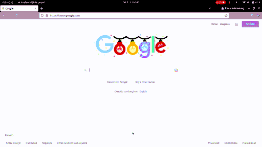
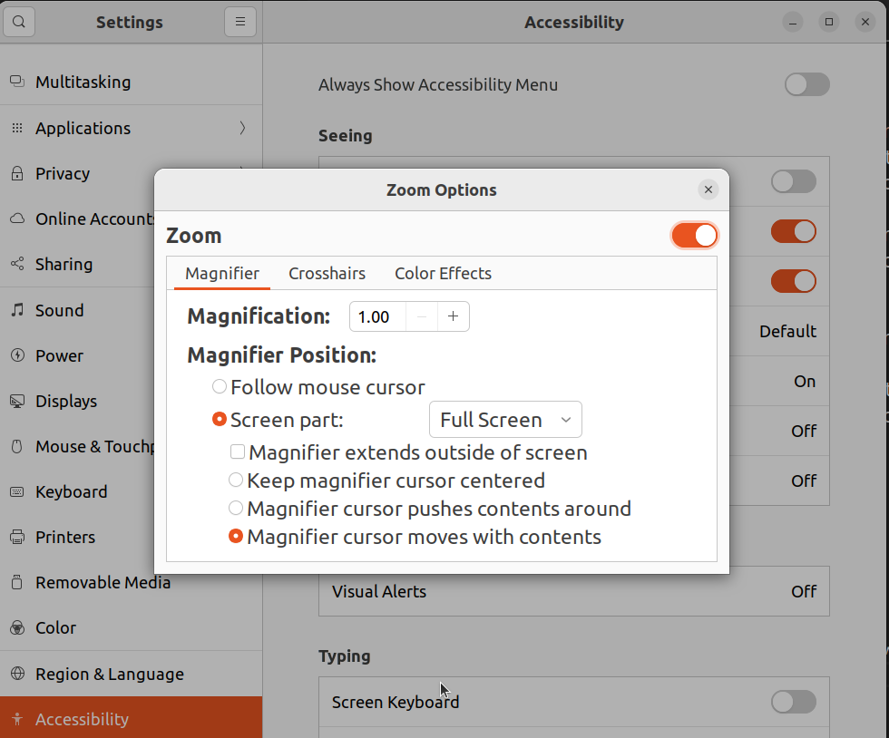

Its been years since the last time I used MacOS, Pinch to zoom is the only feature I have missed from it, while I have used workarounds, I finally put enough time to get this feature working on Ubuntu 22.04, this post explains how I did it.

## Demo

Let's start with a demo showcasing the final integration:

- Holding `alt` + trackpad scroll-down triggers zoom-in.
- Holding `alt` + trackpad scroll-up triggers zoom-out.



## Summary

1. Let's enable the Zoom feature on the accessibility settings (`Settings` -> `Accessibility` -> `Zoom`), tweak them to the way you like them and keep the Magnification rate at `1.00`. Ubuntu 22.04 will enable shortcuts to update the zoom level by 1 while I prefer to set `0.2` as the rate.
2. Let's create 2 bash scripts to increase/decrease the zoom level.
3. Let's integrate `xbindkeys` to define mouse/trackpad shortcuts to invoke our zoom in/out scripts, be aware that it won't work at Gnome desktop/terminal.
4. Optionally switch the UI server from Wayland to Xorg so that the shortcuts work at Gnome desktop/terminal.

## Details

Let's dive into the details.

### 1. Enable Zoom accessibility feature

This is relatively simple, just go to `Settings` -> `Accessibility`, tweak the options until you find what works for you, then, enable the Zoom option.



There won't be any visible effect unless you update the Magnification rate, there are shortcuts to do so:

1. `super`+`alt`+`=` triggers zoom in.
2. `super`+`alt`+`-` triggers zoom out.

While these shortcuts could be useful enough, the Magnification rate is increased/decreased by `1` which is just too much for me.

**NOTE**: If this feature gets disabled, the scripts won't, while the Magnifier rate gets updated, the scripts do not enable the feature, feel free to tweak the scripts to do so.

### 2. Create scripts to manage the zoom level

The goal is simple, we'll have two scripts (while we could merge these into a single script, I preferred to keep them separated for simplicity):

1. `~/scripts/zoom-in.sh` which increases the zoom rate by `0.2`
2. `~/scripts/zoom-out.sh` which decreases the zoom rate by `0.2`.

> ~/scripts/zoom-in.sh

```shell
#!/usr/bin/env bash
# Increases the magnifier rate up to a defined maximum
set -e

maxValue=4.0

# the gnome desktop entry to be updated
key="org.gnome.desktop.a11y.magnifier mag-factor"
current=$(gsettings get $key)
step=0.2
newValue=$(echo "$current + $step" | bc -l)

# same as: rate=min(current+step, maxValue)
if (( $(echo "$newValue < $maxValue" | bc -l) ))
then
  echo "Zoom level must be increased to $newValue";
else
  newValue=$maxValue
  echo "Zoom level must be set to its max value: $maxValue"
fi
output=$(gsettings set $key $newValue)
```

> ~/scripts/zoom-out.sh

```shell
#!/usr/bin/env bash
# Decreases the magnifier level down to a defined minimum

minValue=1.0

# the gnome desktop entry holding the zoom rate
key="org.gnome.desktop.a11y.magnifier mag-factor"
current=$(gsettings get $key)

# same as: rate=max(current-step, minValue)
step=0.2
newValue=$(echo "$current - $step" | bc -l)
if (( $(echo "$newValue > $minValue" | bc -l) ))
then
  echo "Zoom level must be decreased to $newValue";
else
  newValue=$minValue
  echo "Zoom level must be set to its min value: $minValue"
fi
output=$(gsettings set $key $newValue)
```

Make these scripts executable: `chmod +x ~/scripts/zoom-in.sh ~/scripts/zoom-out.sh`, then, try them:

1. Zoom-in: `~/scripts/zoom-in.sh`
2. Zoom-out: `~/scripts/zoom-out.sh`

### 3. Trigger the zoom in/out scripts with the trackpad scroll

While Gnome keyboard settings support shortcuts, I did not found a way to use the trackpad events on those, I ended up finding `xbindkeys` which worked nicely, that's what we'll use in this post.

First, install `xbindkeys`, gladly, it is available at the ubuntu default repositories: `sudo apt install xbindkeys`

Be aware that `xbindkeys` won't be executed automatically, also, you can start multiple processes from it (which is unnecessary), I suggest to run it with `xbindkeys --nodaemon` until you are happy with the result, this way, you will see `xbindkeys` logs in your terminal.

Create `~/.xbindkeysrc` file which is the file used to define your shortcuts, mine looks like this:

```shell
# increase/decrease magnifier's rate with mouse scroll + alt key
# source https://superuser.com/a/1713208
"~/scripts/zoom-in.sh"
    alt+b:4
"~/scripts/zoom-out.sh"
    alt+b:5
```

Once you save the settings, `xbindkeys` will pick them, go to any non-gnome window to try the changes (check the logs from `xbindkeys` to make sure there are no issues). If everything works, kill `xbindkeys` and run it as a daemon (`xbindkeys` only)

I don't really know much about this but `b:` seems to specify that we are interested in the trackpad, while `4`/`5` mean trackpad buttons.

**Hint** How can you find that button `4`/`5` are the ones you are interested in? A way is to launch `xev` from your terminal, then, anything that you do on the small window will be logged, for example, scrolling up displays `state 0x0, button 5, same_screen YES`, here is button `5`.

**NOTE** Like I mentioned at the summary, `xbindkeys` won't work at gnome desktop/terminal when it we are using Wayland UI server.

### 4. Switch from Wayland to Xorg

This step is optional, it all depends on whether Wayland is working fine for you, in my case, I can't share my screen in calls, hence, I ended up switching back to Xorg.

Once you are on Xorg, `xbindkeys` should do its work, which means, pinch to zoom will work

I'd advice you to test that switching to Xorg won't break anything, to do so, log out from your session to see the login screen, once you select a user, there will be a settings icon on the bottom-right corner, such settings icon allows you to start a session with Xorg.

Making the switch permanent can be done by editing `/etc/gdm3/custom.conf`, set `WaylandEnable=false`, file will look like:

```ini
# GDM configuration storage
#
# See /usr/share/gdm/gdm.schemas for a list of available options.

[daemon]
# Uncomment the line below to force the login screen to use Xorg
WaylandEnable=false

...
```

That's it, pinch to zoom integration should work now just like it works on MacOS.

## More

There is a problem with this integration while using some apps (terminal, text editors), for some reason, the text starts scrolling while you are zooming in/out, I haven't dig into solving this, if you know the solution, please share.

Also, I have used CompizConfig Settings Manager in previous Ubuntu versions, in theory, it can get you the same effect, unfortunately, I gave up because it didn't seem to cause any effect. Later I found that `xbindkeys` did not worked consistently while using Wayland, I'll likely try this alternative when I reinstall my OS, if you try it, please share the outcome.

## Conclusion

We have followed one approach to simulate the MacOS pinch to zoom on Ubuntu 22.04, while there are a couple of improvements, I'm very happy with the end result.

While it would be ideal to be able to get this behavior without installing any extra tools, it is nice that we are able to customize linux enough.
