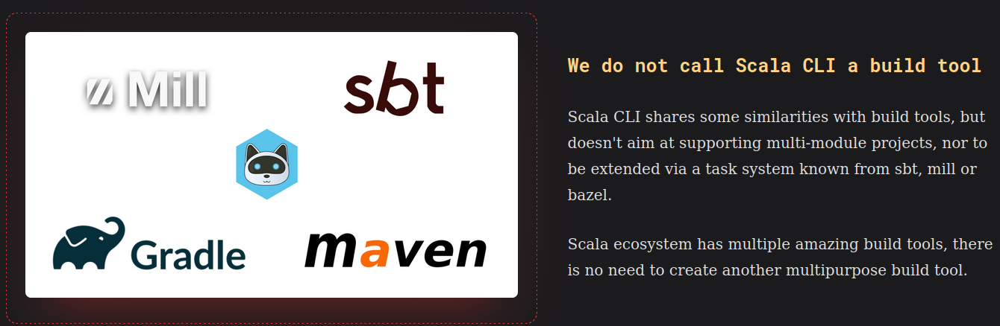
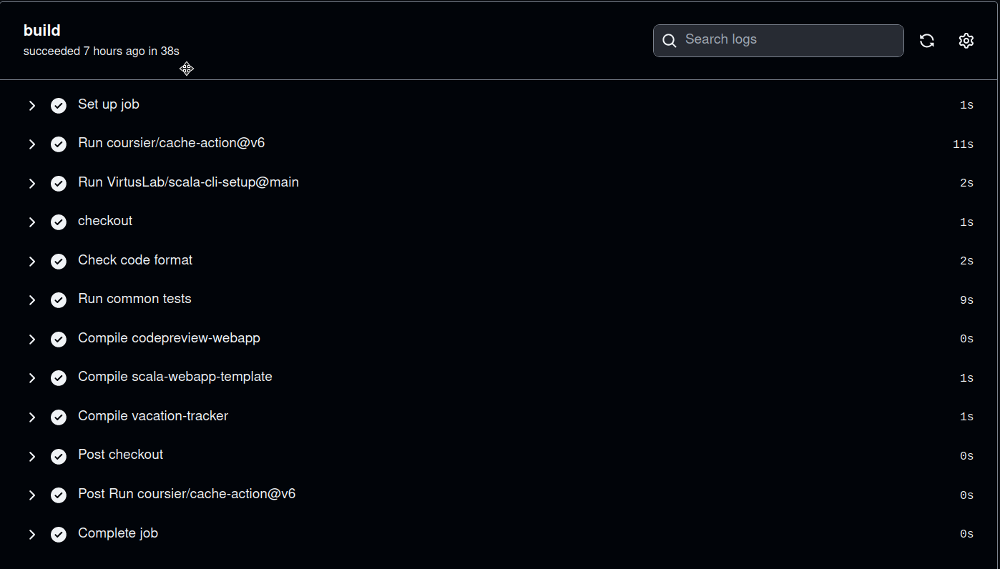
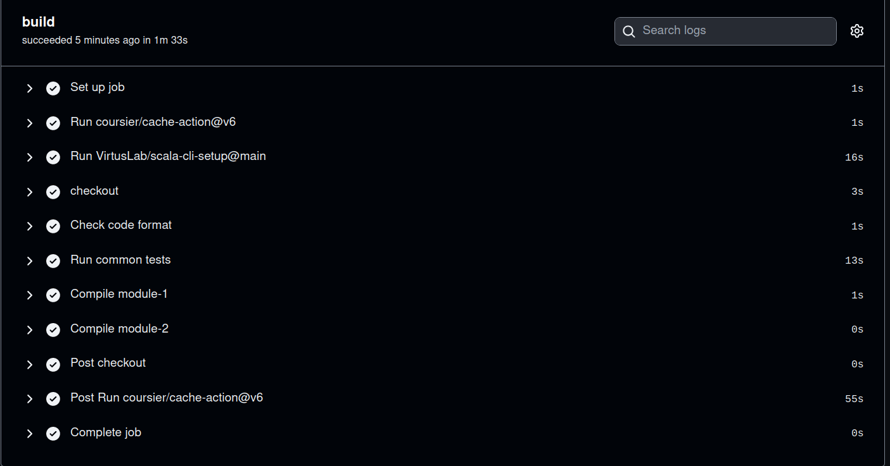
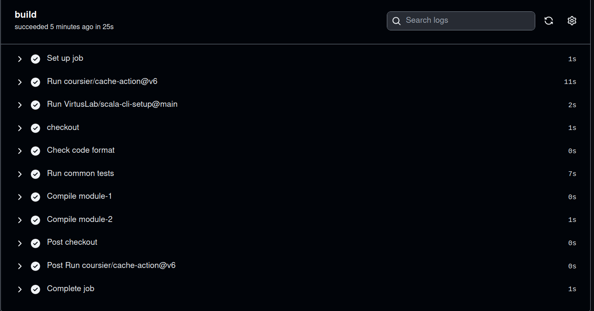

This is a somewhat controversial post because we got to use [scala-cli](https://scala-cli.virtuslab.org) outside its purpose, as a build-tool for a multi-module project.



> scala-cli: We do not call Scala CLI a build tool

So far, we are very happy with the outcome and we are keen to continue trying this approach in other simple projects.

## Summary

I have been jealous from Rust ecosystem in the sense that `cargo` already handles many common tasks without the need to install any plugin, for example, besides compiling and running the app, it also executes the tests, formats the code, packages the application into a binary, etc.

Turns out that `scala-cli` let us do that and more, all of this with a fast startup time (no need to load 13k settings at startup, looking at you sbt).

Not only that, our Continuous Integration (CI) workflow runtime is consistently below 1 minute (check code format, run tests, package modules), the most expensive step being downloading dependencies (which is cached):



> 38s github-actions workflow execution

## Context

The project benefiting from this setup is [codepreview.io](https://codepreview.io), a tool to create preview environments from Pull Requests which is mainly built with Scala and shines with Scala projects.

The way that [codepreview.io](https://codepreview.io) works is by defining a small Scala script that holds the custom environment requirements for each project, such a script gets packaged by scala-cli, and, it eventually get executed by a CI workflow that creates the preview environment.

## Show me the code

I have prepared a [demo](https://github.com/wiringbits/scala-cli-multi-module-demo) repository for this.

This is the file structure:

```shell
├── common
│   ├── SharedCode.scala
│   └── SharedCode.test.scala
├── LICENSE
├── module-1
│   ├── App.scala
│   └── package.sh
├── module-2
│   ├── App.scala
│   └── package.sh
└── README.md

3 directories, 8 files
```

- [common/SharedCode.scala](https://github.com/wiringbits/scala-cli-multi-module-demo/blob/main/common/SharedCode.scala) holds the code that's shared by `module-1` and `module-2`.
- [common/SharedCode.test.scala](https://github.com/wiringbits/scala-cli-multi-module-demo/blob/main/common/SharedCode.test.scala) has the tests for `SharedCode.scala`
- [module-1/App.scala](https://github.com/wiringbits/scala-cli-multi-module-demo/blob/main/module-1/App.scala) is the module-1 application source.
- [module-2/App.scala](https://github.com/wiringbits/scala-cli-multi-module-demo/blob/main/module-2/App.scala) is the module-2 application source.

Let's expand `module-1/App.scala`:

```scala
//> using file "../common/SharedCode.scala"

object App {
  def main(args: Array[String]): Unit = {
    println(
      renderText("module-2")
    )
  }
}
```

## Show me the CI

The CI is compiling the code, checking its format, as well as packaging the module apps.

The [first execution](https://github.com/wiringbits/scala-cli-multi-module-demo/actions/runs/4916752733/jobs/8780920466) took 1m33s, most of the time is spent downloading and caching dependencies:



The [first execution](https://github.com/wiringbits/scala-cli-multi-module-demo/actions/runs/4916771498/jobs/8780964617) took only 25s! This is an outstanding runtime for scala projects:



## Conclusion

While scala-cli does not advertise itself as a build-tool, we saw that it can be a viable option for small projects.

I'm keen to try it on bigger projects and see how far we can go, could it possible be as nice for a simple fullstack Scala application?

Thanks.
