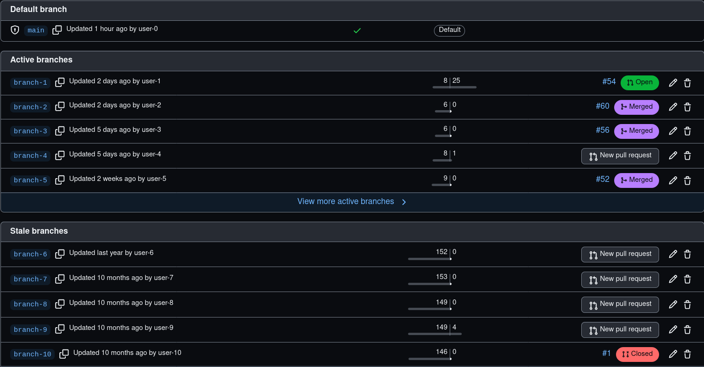
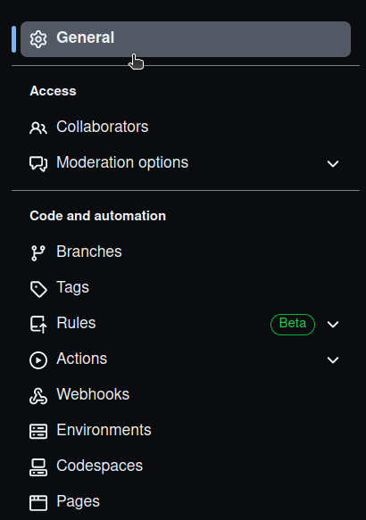
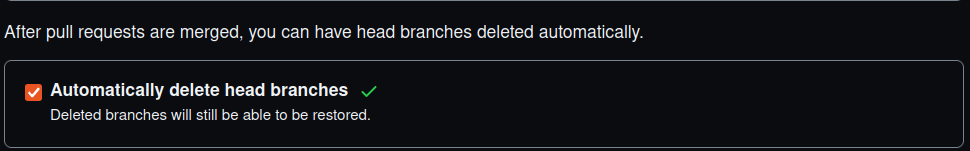
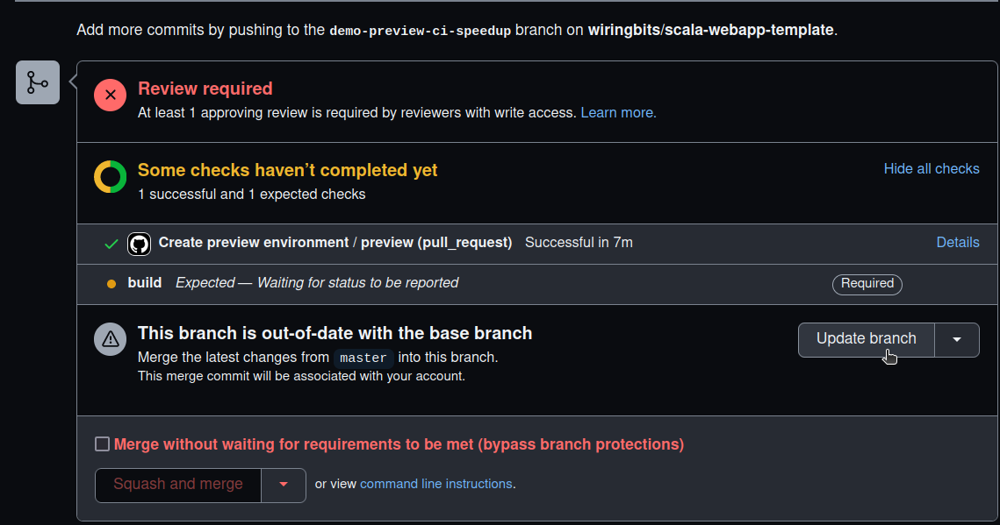
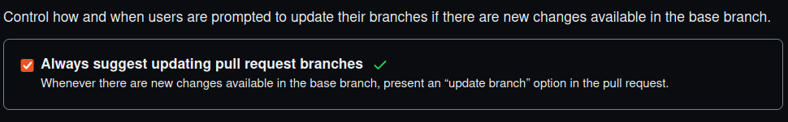
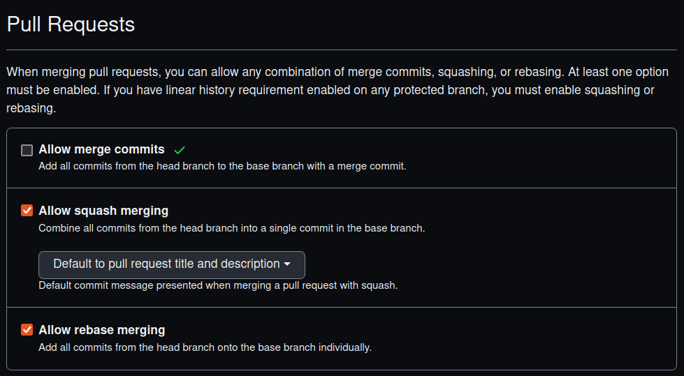
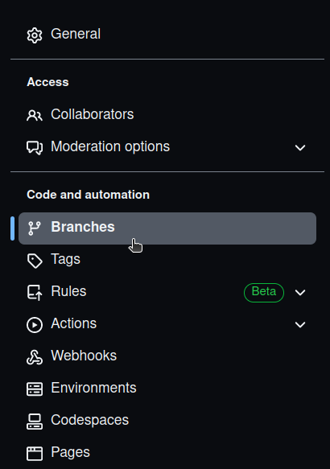
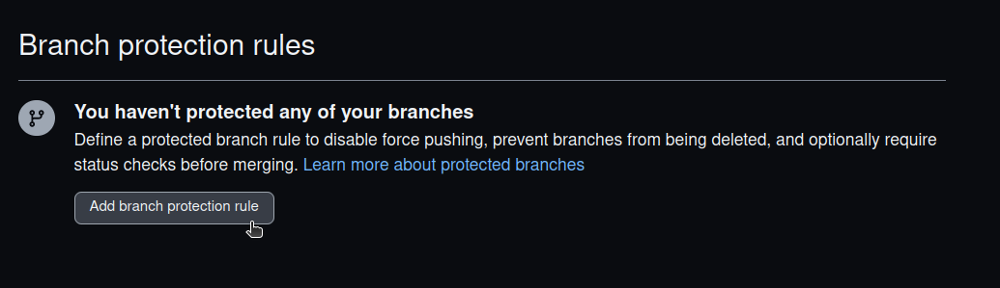
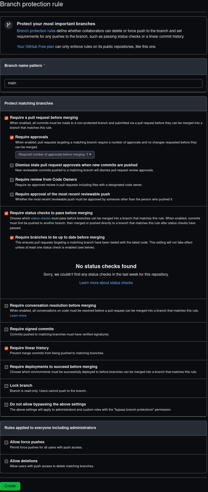
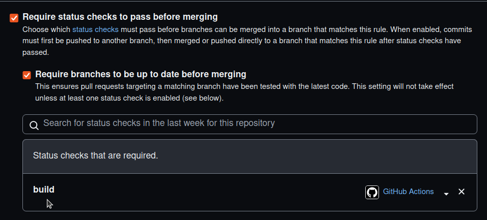

While working with multiple customers, we commonly suggest potential improvements to their Github repository setup, there is a chance others can benefit from this which is why I'm sharing the settings we follow while create new repositories.

Have you ever seen a situation like this? Many stale branches because developers forgot to delete those, this is a very common problem, I have even seen repositories with 1000+ stale branches which makes it hard to navigate through them, the below settings mention a way to prevent this as well as other useful details.

It would be nice if we could store these settings so that they get applied to new repositories by default, unfortunately, Github does not seem to support this.

## Summary

We'll tweak the repository `General` and `Branches` settings so that:

1. Enable `Automatically delete head branches`.
2. Enable `Always suggest updating pull request branches`.
3. Disable `Allow merge commits` (read below before arguing).
4. Update `Allow squash and merging` -> `Default commit message`.

Then, create a branch protection rule for important branches:

1. Enable `Require a pull request before merging` -> `Require approvals`.
2. Enable `Require status checks to pass before merging` -> `Require branches to be up to date before merging`
3. Enable `Require linear history`.

The reasons behind these settings are explained below.

## General settings

Access these items through the `Settings` button that's on each repository:

## 1. Automatically delete head branches

This is likely the item that most projects can apply, I don't know why Github does not set this by default.

Remember the stale branches issue that's mentioned in the intro? This is how you can prevent it, as soon as a Pull Request gets merged, the branch will be deleted automatically by Github.

Is there any reason to keep these stale branches around?

## 2. Always suggest updating pull request branches

There are cases when a Pull Request has passed all the CI workflows but these workflows fail when merging the code just because the PR was out of date.

Updating branches manually can be tedious, gladly, Github can place a button to update the branch:

The only reason I can find to not enable this option is when the repository requires signed commits, because Github can't sign the merge commit that updates the branch.

This option can be enabled at the General settings too.

## 3. Pull Request settings

On the PR settings, I disable the `Allow merge commits` to keep a simple commit history, before you start arguing about this, let me tell you, this option unlocks the usage of [git bisect](https://git-scm.com/docs/git-bisect) which is totally worth it:

Also, on the `Squash and merging` item, update the default commit message to `Default to pull request title and description`, this will make sure that most merged PRs will get a single commit with the message that's included on the PR description (your team includes a decent one, right?).

`Squash` means mixing all the commits from a PR into a single one, this means that devs can still push many commits into a single PR but rolling back a feature requires reverting a single commit. Which is another advantage.

## 4. Branch protection rules

We are interested in the `Branches settings` entry which can be found a few items below the `General` settings:

Let's add rules to protect our important branches, usually, a single branch needs to be protected, `master`/`main`, this depends on your team setup:

The options to enable are shown in this screenshot:

All of these options are explained below.

### 4.1. Require a pull request before merging

Most teams aren't ready to allow all team-members to submit commits directly to `main` branch, if this is your case, enabling the `Require a pull request before merging` option would prevent devs to introduce any code directly to the protected branches, requiring them to submit a PR.

### 4.2. Require approvals

If your team does code reviews, enabling the `Require approvals` options would prevent any PR to get merged unless it has `N` approvals, `1` is usually enough for most projects.

Btw, if you do code reviews, you can also do code previews with https://codepreview.io, mention this post to get an extended trial.

### 4.3. Require status checks to pass before merging

Enabling the `Require status checks to pass before merging` option allows you to define some conditions that need to be met before being able to merge a PR, for example:

1. Enabling `Require branches to be up to date before merging` prevents that outdated branches get merged.
2. Enabling other status checks is also possible, this can prevent PRs to get merged when the CI workflows are failing.

### 4.4 Require linear history

This ones goes hand by hand with the `Allow merge commits` option disabled by a previous step, this step will make sure that no merge commits will be allowed, which unlocks the power from [git bisect](https://git-scm.com/docs/git-bisect).

## Conclusion

We have seen many useful settings for Github repositories which can be applied to most projects, these can improve your experience while working with Github.

Do you know anything else that could possibly be set as default?
