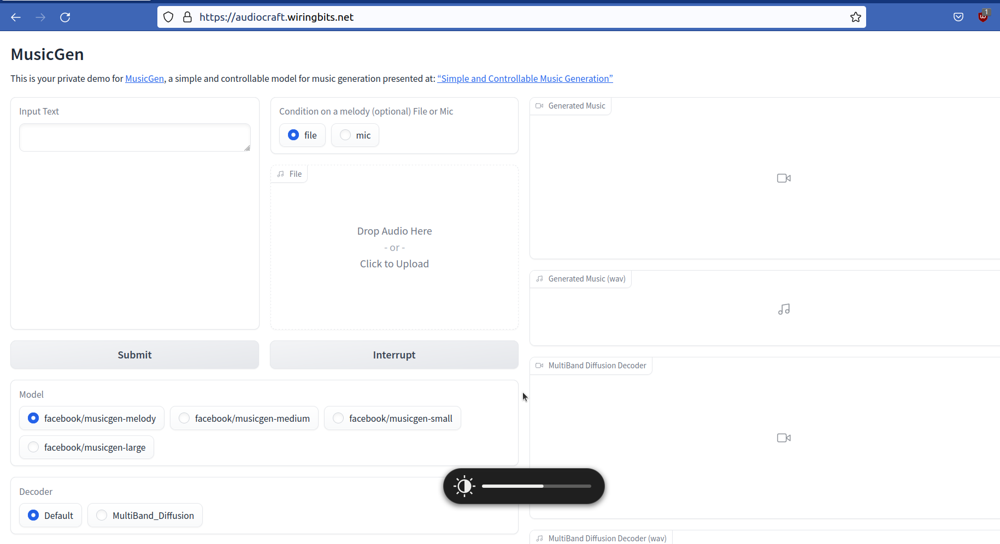
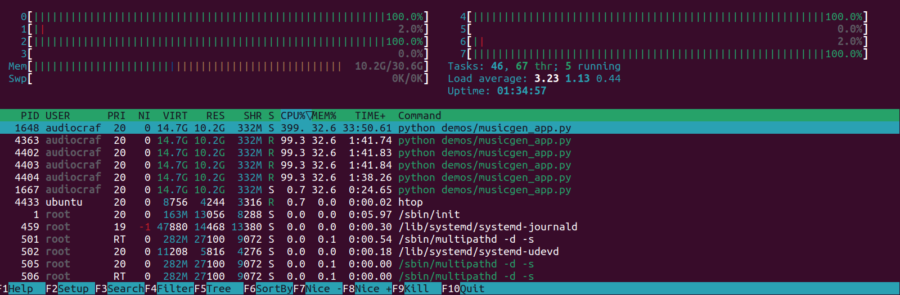
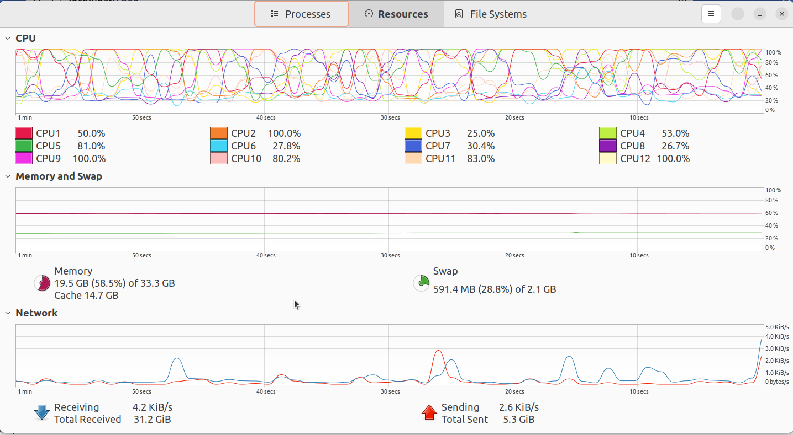

A few days ago, [AudioCraft](https://ai.meta.com/blog/audiocraft-musicgen-audiogen-encodec-generative-ai-audio/) was released to the public, this post assumes that you know what it is but you may not have played with it yet.

AudioCraft idea sounds pretty cool, when I shared the news with my family, they were keen to give it a try, unfortunately, there isn't any live version to play with.

Given that I just delivered a project, what could be a better prize than playing with new tech? I decided to launch AudioCraft in a server so that my family can play with it.

This post explains how I deployed AudioCraft to Ubuntu 22.04, you can try the live version at [audiocraft.wiringbits.net](https://audiocraft.wiringbits.net), I don't know how much load the server will handle but it should be enough to let a few visitors play.

**NOTE** The live server will be public for a few days only.

> Ad: Do you need a reliable dev to help with your project or infrastructure? I'll be talking to potential customers next week to choose my next project.


## Summary

A powerful server is required to run AudioCraft, from my tests, the app seems to require at least 12G of memory + a lot of CPU power, it consumes most of my computer resources, specially when processing a request.

I'll use an old-school approach that involves nginx as the reverse proxy which handles TLS + a systemd service to make sure that AudioCraft runs when the server starts, as well restarting it when it crashes.

[Hetzner](https://www.hetzner.com/) is the provider where I'll host my dedicated server for a reasonable price, given the high CPU requirement, I doubt that a shared cpu would behave nicely but I haven't tried, I selected the `CCX32` version which has 8 vCPUs + 32G memory + 240G disk, costing `77 €`/month. 

## Details

The following details include the exact steps I took to launch AudioCraft in my own Ubuntu 22.04 server until I got to the current version that's live at [audiocraft.wiringbits.net](https://audiocraft.wiringbits.net)


### 1. Create a server

I have selected the `CCX32` version from Hetzner (a dedicated server) running Ubuntu 22.04:


I have included an ipv4 + a firewall adequate for a webapp (allowing traffic only on ports 22/80/443):


There is no need to enable backups or increase the disk size, from my tests, we are limited by the CPU.

**NOTE** There is a high chance that using a server with a dedicated GPU can improve the performance considerably but I couldn't find any on Hetzner which can be created immediately.

You should be able to log into the server with ssh `ssh root@[ipv4]` (replace `[ipv4]` with your server ip).


### 2. Initial setup

This brief section includes steps I follow in all my servers.

Apply standard updates and useful packages:

```shell
apt update
apt upgrade
apt install ntp fail2ban
```

**NOTE** A system restart may be suggested.

Install AudioCraft dependencies (see [action.yml](https://github.com/facebookresearch/audiocraft/blob/main/.github/actions/audiocraft_build/action.yml)):

```shell
apt install libsndfile1-dev ffmpeg python3-pip python3.10-venv
```

Create a system user, an unprivileged user who will run AudioCraft:

```shell
useradd audiocraft --create-home --system
```

**NOTE**: If you plan to leave this server running for a while, it is a good idea to do a few extra steps like disabling root login and adding another user to handle that, as well as disabling login by password, changing the default ssh port can be a good idea too.


### 3. First AudioCraft execution

Let's start by switching to the `audiocraft` user, the one who will execute AudioCraft:

```shell
sudo su -s /bin/bash - audiocraft
```

Clone the AudioCraft repository and move to such a directory:

```shell
git clone https://github.com/facebookresearch/audiocraft.git
cd audiocraft/
```

Create a virtual environment for executing AudioCraft and switch to it:

```shell
python3 -m venv .venv
. .venv/bin/activate
```

Install AudioCraft Python dependencies:

```shell
python -m pip install --upgrade pip
pip install -r requirements.txt

```

Install AudioCraft packages:

```shell
pip install -e '.[dev]'
```

Finally, execute AudioCraft:

```shell
python demos/musicgen_app.py
```

AudioCraft should be running now, use `ctrl+C` to stop it, while this has a few drawbacks:

1. AudioCraft execution will stop as soon as your ssh session is terminated.
2. AudioCraft won't run if the server is restarted or if AudioCraft crashes.

Still, it is good to do this for verifying that the execution will work, you can test this in two ways:

1. Launch a second ssh-session and run `curl localhost:7860`, the result must show some kind of html.
2. Expose AudioCraft to your computer by opening an ssh tunnel like `ssh -nNT -L 7860:localhost:7860 root@[ipv4]`, then, load `localhost:7860` in your favorite browser.

Once you verify that AudioCraft worked, stop the service (`ctrl+C`) and exit (run `exit`) the session, you should be back to the root shell.


### 4. Add systemd service

This is the time to solve the drawbacks from step 3, let's create a systemd service by filling `/etc/systemd/system/audiocraft.service` with this content (use your preferred editor):

```shell
[Unit]
Description=audiocraft musicgen_app

[Service]
Type=simple
WorkingDirectory=/home/audiocraft/audiocraft
StandardError=journal
StandardOutput=journal
StandardInput=null
LimitNOFILE=65535
User=audiocraft
ExecStart=/bin/sh -c ". .venv/bin/activate && python demos/musicgen_app.py --username=iMustConsiderHiringAlexis --password=toMaintainMyProjectOrCreateAnMVP"
Restart=on-failure

[Install]
WantedBy=multi-user.target
```

**NOTE**: Edit the values from the `--username`/`--password` settings, this protects your instance from unauthorized usage, removing those will leave the service public like mine (for now).

Tell systemd to load the new service `systemctl daemon-reload` and start the service with `service audiocraft start`.

These commands will be helpful:

1. Check the service status: `service audiocraft status`
2. Stop the service: `service audiocraft stop`
3. Restart the service: `service audiocraft restart`
4. Check the logs `journalctl -u audiocraft -f`

Verify that AudioCraft is working (see step 3 for alternatives), then, run `systemctl enable audiocraft` to start AudioCraft when the server starts.

**NOTE**: Remember we set a firewall preventing AudioCraft from being accessed from anywhere outside of its server.


## 5. Expose AudioCraft to the internet

In my case, I'll create a subdomain to access AudioCraft, you will need to update your DNS to add an `Alias`/`A` record, like this:


A way to verify that the record has been propagated is by running `dig A audiocraft.wiringbits.net` (use your own domain), it must print the ip address from your server, like:

```
...
;; ANSWER SECTION:
audiocraft.wiringbits.net. 1561	IN	A	65.21.255.90
...
```

Once this is done, let's add the nginx server settings, I created `/etc/nginx/sites-enabled/audiocraft.wiringbits.net` with this content:

```
server {
  listen 80;

  server_name audiocraft.wiringbits.net;

  # websocket
  location /queue/join {
    proxy_pass http://localhost:7860;
    proxy_http_version 1.1;
    proxy_set_header Upgrade $http_upgrade;
    proxy_set_header Connection "upgrade";
    proxy_read_timeout 86400;
  }

  # normal requests
  location / {
    proxy_pass http://127.0.0.1:7860;
  }
}
```

**NOTE**: Update the `server_name` to match your domain.

Then, `service nginx reload` will pick the new settings, this should allow you to use AudioCraft from your own domain, for example, visiting `http://audiocraft.wiringbits.net` would work (https version next).


### 6. Get TLS certificate

We'll use [Certbot](ttps://certbot.eff.org/instructions?ws=nginx&os=ubuntufocal) for this task, which generates TLS certificates from LetsEncrypt.

The steps are simple:

```shell
apt install snapd
snap install --classic certbot
certbot --nginx
```

Just follow the instructions and your TLS certificate must be deployed.


## Some screenshots

The UI from MusicGen, the AudioCraft demo app deployed by this guide:



CPU/Memory usage from `htop` when AudioCraft is processing a request:



My laptop crazy usage when AudioCraft is processing a request:




### Conclusion

In this post we have covered a detailed guide for running your own AudioCraft server in Ubuntu 22.04, I'm still playing with this interesting piece of technology, deploying your own server can allow you to share AudioCraft with your loved ones.
